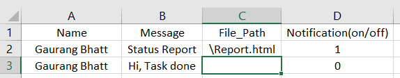

This is an opensource application written in python language designed specially for small/medium scale companies. 
This application can be easily used for sendnig marketing brouchures, status report, marketing or product details to customer through WhatsApp Web.

All needed is to put details in config.csv file as per columns and Message,File or both will be sende to client.
WhatsApp_Message.exe file is in /dist folder with config.csv and log.txt for logging the notification details.

Do Sacn QR code in 100 sec time period

