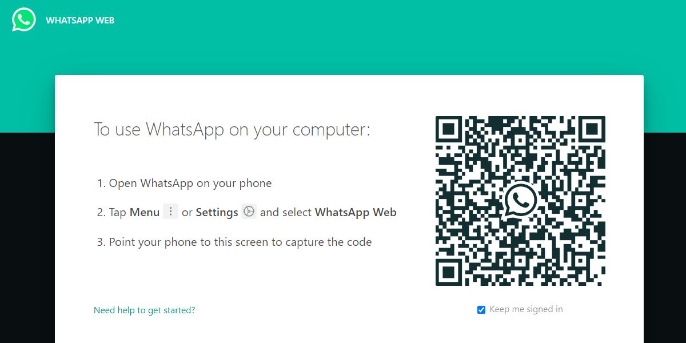

# **WhatsApp Message Automation** #
This is an opensource application written in python language designed specially for small/medium scale companies. 
This application can be easily used for sendnig marketing brouchures, status report, marketing or product details to customer through WhatsApp Web. 

All needed is to put details in config.csv file as per columns and Message, File or both will be sende to client. 
WhatsApp_Message.exe file is in /dist folder with config.csv and log.txt for logging the notification details. 

# **Features** # 
1. Send message to multiple users or client .
2. Setup in your daily recurring task, after code run modify csv using any Programming language and run WhatsApp_Message.exe .
3. OS Notifications online/offline and log for Clients allowed in Notification(on/off) column 1 as allow 0 not .
4. Allow Text message as well as file send like .

**Check Chrome version from Help > About Chrome >Version . This chromedriver.exe is of latest version 85.0.4183.121** 
Download as per your chrome version from https://chromedriver.chromium.org/  
**For Linux and Windows Both**  
**use wine in linux** 
**Only for Chrome Browser | Update of Firefox would be added** 

Do Scan QR code in 100 sec time period

For any query and feature suggest/request email at gaurangbhatt19@gmail.com
